# Manual del Sistema — IntegraID

## Sistema de Gestión de Comedor Estudiantil y Biblioteca

**CTP de Liberia, Guanacaste — Costa Rica**

| Dato | Valor |
|---|---|
| Nombre del sistema | Integra ID |
| Módulo de comedor | ComeID |
| Módulo de biblioteca | Bibliogest |
| Portal de estudiantes | ComeID Estudiantes |
| Tipo de Proyecto | Desarrollo práctico — Plataforma web |
| Metodología de referencia | RUP — Proceso Racional Unificado |
| Versión del sistema | 1.12.0 |
| **Autora** | **Bianka Fernanda Hernández Araya** |

---

## Resumen

El control de la asistencia al comedor estudiantil y de los préstamos de una biblioteca escolar son procesos que toda institución educativa debe realizar a diario, y que se vuelven difíciles de controlar cuando el número de estudiantes es grande y no se dispone de mecanismos que agilicen el registro. Este documento presenta el desarrollo de **Integra ID**, una plataforma web que centraliza la gestión del **comedor estudiantil** y de la **biblioteca** del Colegio Técnico Profesional (CTP) de Liberia.

El sistema permite registrar a los estudiantes con sus cuentas de acceso, controlar la asistencia diaria al comedor mediante el **escaneo de códigos QR**, planificar el menú semanal con ayuda de **inteligencia artificial**, llevar la lista de invitados externos, digitalizar el catálogo de la biblioteca con préstamos, devoluciones y reservas, y dar al estudiante un **portal de auto-servicio** donde consulta su menú, su asistencia, sus libros y su credencial QR.

Para controlar el proceso de desarrollo se utilizó como referencia la metodología **RUP**, dirigida por casos de uso y centrada en los requisitos del proyecto. Para validar los requisitos funcionales y no funcionales se estableció un caso de prueba por cada requisito, y la seguridad se apoya en las **reglas de Firestore** verificadas del lado del servidor de Firebase y en cabeceras de seguridad web (CSP).

**Palabras clave:** comedor estudiantil, biblioteca escolar, código QR, asistencia, inteligencia artificial, Firebase, casos de uso.

**Abstract:** This document presents Integra ID, a web platform that centralizes the management of the student cafeteria and the school library of the CTP de Liberia. It allows registering students, controlling daily cafeteria attendance by QR code scanning, planning the weekly menu with the help of artificial intelligence, and providing students with a self-service portal. The development process follows the RUP methodology, driven by use cases, and security relies on server-side Firestore rules.

---

## Índice de contenidos

1. **Introducción** — 1.1 Justificación · 1.2 Planteamiento del trabajo · 1.3 Estructura del documento
2. **Descripción general del sistema** — 2.1 Perspectiva del producto · 2.2 Funcionalidad del producto · 2.3 Características de los usuarios · 2.4 Restricciones
3. **Especificación de requisitos** — 3.1 Requisitos funcionales (RF) · 3.2 Requisitos no funcionales (RNF)
4. **Arquitectura y tecnologías**
5. **Vista de casos de uso**
6. **Representación gráfica de procesos** — 6.1 Simbología de diagrama de flujo · 6.2 Diagrama de flujo del sistema
7. **Especificación de casos de uso** — 7.1 Panel de administración · 7.2 Portal de estudiantes
8. **Trazabilidad de requisitos** — 8.1 Casos de prueba RF · 8.2 Casos de prueba RNF
9. **Seguridad del sistema**
10. **Conclusiones y trabajo futuro**
11. **Anexos** — A.1 Ficha técnica · A.2 URLs del sistema · A.3 Preguntas frecuentes · A.4 Glosario · A.5 Capturas de pantalla

---

# 1. Introducción

## 1.1 Justificación

El comedor estudiantil y la biblioteca del CTP de Liberia atienden a cientos de estudiantes cada día. Los métodos manuales (listas de papel, hojas de préstamo, planillas de asistencia) generan colas, errores de registro, pérdida de trazabilidad y dificultad para producir reportes. Además, el personal debe repetir la captura de los mismos datos de un estudiante en cada servicio.

Surge entonces la necesidad de una **plataforma única** que:

- Acelere el registro de asistencia al comedor (un estudiante por segundo con el escáner QR).
- Centralice los datos de estudiantes en una sola base de datos compartida entre comedor y biblioteca.
- Automatice la gestión de préstamos, devoluciones y reservas de la biblioteca.
- Reduzca el desperdicio de comida mediante predicción de demanda.
- Facilite reportes para la administración del centro educativo.

## 1.2 Planteamiento del trabajo

El objetivo del trabajo es desarrollar e implementar **Integra ID**, un sistema web que controle la asistencia estudiantil al comedor mediante escaneo de códigos QR y que gestione la biblioteca escolar, con un portal de auto-servicio para los estudiantes. El sistema fue desarrollado con tecnología **Firebase** (Auth, Firestore, Hosting) y publica dos aplicaciones web: el **panel del personal** y el **portal de estudiantes**.

El presente manual documenta el sistema siguiendo la estructura de un trabajo académico: describe el sistema, especifica los requisitos funcionales y no funcionales, presenta los diagramas de casos de uso, la **representación gráfica de procesos** (diagrama de flujo con su simbología), la especificación de casos de uso, la trazabilidad de requisitos con sus casos de prueba, la seguridad y las conclusiones.

## 1.3 Estructura del documento

Capítulo 1: Introducción. Capítulo 2: descripción general del sistema. Capítulo 3: especificación de requisitos funcionales y no funcionales. Capítulo 4: arquitectura y tecnologías. Capítulo 5: vista de casos de uso. Capítulo 6: representación gráfica de procesos (diagrama de flujo). Capítulo 7: especificación de casos de uso. Capítulo 8: trazabilidad de requisitos. Capítulo 9: seguridad del sistema. Capítulo 10: conclusiones y trabajo futuro. Anexos.

---

# 2. Descripción general del sistema

## 2.1 Perspectiva del producto

**Integra ID** es un sistema web que reúne, en un solo inicio de sesión y una sola base de datos, todas las herramientas digitales del centro educativo relacionadas con el comedor y la biblioteca. Se compone de **tres módulos**:

| Módulo | ¿Qué hace? | Usuarios |
|---|---|---|
| **ComeID** | Gestión del comedor estudiantil | Personal (admin, profesor, bibliotecario) |
| **Bibliogest** | Gestión de la biblioteca | Personal con rol bibliotecario/admin |
| **Portal de Estudiantes** | Auto-servicio del estudiante | Estudiantes registrados |

Las tres partes **comparten los mismos datos**: si el personal registra a un estudiante en el comedor, ese estudiante aparece en la biblioteca y puede entrar a su portal. No hay que cargar datos dos veces. La biblioteca puede funcionar de forma **independiente** del comedor: un estudiante puede comer en el comedor o no, pero aun así usar la biblioteca.

## 2.2 Funcionalidad del producto

El sistema permite al personal:

- Registrar y administrar estudiantes, generar sus códigos QR y crear cuentas de acceso.
- Controlar la asistencia diaria al comedor mediante **escaneo de QR** (sin colas).
- Importar estudiantes y libros/socios de biblioteca de forma masiva desde Excel o CSV.
- Planificar el **menú semanal** (lunes a viernes) con ayuda de **inteligencia artificial**.
- Llevar la lista de **invitados externos** del comedor.
- Predecir la **demanda** del comedor para planificar compras.
- Gestionar la biblioteca: catálogo, socios, préstamos, devoluciones y reservas, con **disponibilidad en tiempo real**.
- Prestar y devolver libros **escaneando el QR** del ejemplar (con respuesta sonora y visual).
- Enviar **notificaciones** a los estudiantes.
- Exportar **reportes** a Excel y PDF.
- Consultar el **historial de actividades** (auditoría).

Y al estudiante, desde su portal:

- Registrarse y vincular su cuenta con su expediente del colegio.
- Ver el menú del comedor y su propia asistencia.
- Consultar el catálogo disponible de la biblioteca y sus préstamos, reservas e historial.
- Presentar su **credencial QR**.
- Recibir notificaciones del colegio.

## 2.3 Características de los usuarios del sistema

| Usuario | Rol | Descripción | Acceso |
|---|---|---|---|
| Administrador | admin | Dirige el sistema: total de secciones, roles, configuración y eliminaciones | Panel del personal |
| Profesor | profesor | Comedor: estudiantes, asistencia, historial, invitados, menú, exportar | Panel del personal |
| Bibliotecario | bibliotecario | Biblioteca completa + menú e historial | Panel del personal |
| Estudiante | estudiante | Portal personal: menú, asistencia, libros, notificaciones, QR | Portal de Estudiantes |

El rol lo asigna **únicamente el administrador** desde la sección *Gestión de Usuarios y Roles*.

## 2.4 Restricciones

- Las dos aplicaciones son **100% frontend** (sin servidor propio); el acceso a los datos está protegido por las reglas de seguridad de **Firestore**.
- El plan de Firebase es **gratuito (Spark)**: sin funciones de servidor ni App Check; por ello no se elimina automáticamente la cuenta de autenticación al dar de baja a un estudiante.
- El menú se configura solo de **lunes a viernes**.
- Se necesita **cámara** para el escaneo de QR y para el registro con foto.
- El almacenamiento de archivos de Firebase está **cerrado** por seguridad; las fotos se guardan como base64 en Firestore.

---

# 3. Especificación de requisitos

## 3.1 Requisitos funcionales

| ID | Nombre | Descripción | Prioridad |
|---|---|---|---|
| **RF01** | Autenticar y autorizar usuario | El sistema permitirá al personal y al estudiante identificarse con correo y contraseña y acceder solo a las opciones que su rol permite. | Alta |
| **RF02** | Gestionar usuario y roles | El sistema permitirá al administrador crear cuentas y asignar roles (admin, profesor, bibliotecario, estudiante), con efecto inmediato. | Alta |
| **RF03** | Gestionar estudiante | El sistema permitirá al admin/profesor registrar, consultar, modificar y eliminar estudiantes, con generación automática de su código QR. | Alta |
| **RF04** | Importar estudiantes masivamente | El sistema permitirá al admin/profesor importar estudiantes desde CSV/Excel con vista previa, creando registros y cuentas en bloque. | Media |
| **RF05** | Registrar asistencia con QR | El sistema permitirá al personal registrar la asistencia diaria del estudiante escaneando su código QR, con confirmación sonora/visual y anti-duplicados. | Alta |
| **RF06** | Gestionar invitados externos | El sistema permitirá al admin/profesor registrar invitados que consumen en el comedor, con control de raciones diarias. | Media |
| **RF07** | Configurar menú semanal | El sistema permitirá al admin/profesor definir desayuno y almuerzo de lunes a viernes, publicándolo en el portal del estudiante. | Media |
| **RF08** | Predicción de demanda (IA) | El sistema analizará el historial de asistencia y proyectará cuántos estudiantes podrían asistir, ayudando a planificar compras. | Media |
| **RF09** | Generar credenciales QR | El sistema permitirá al admin/profesor generar credenciales QR imprimibles o compartibles para cada estudiante. | Media |
| **RF10** | Consultar historial de asistencia | El sistema permitirá consultar el historial diario y por estudiante, con estadísticas, y exportarlo. | Media |
| **RF11** | Gestionar catálogo de libros | El sistema permitirá al bibliotecario/admin agregar, editar, eliminar, buscar e importar libros, con disponibilidad por ejemplar en tiempo real. | Alta |
| **RF12** | Gestionar socios de biblioteca | El sistema permitirá dar de alta socios e importarlos desde Excel/CSV (clave: cédula). | Media |
| **RF13** | Registrar préstamos y devoluciones | El sistema permitirá prestar y devolver libros (con QR opcional), calculando la fecha de vencimiento y actualizando la disponibilidad. | Alta |
| **RF14** | Gestionar reservas | El sistema permitirá reservar un libro prestado o agotado y atender las reservas por orden al devolverse. | Media |
| **RF15** | Alertas de préstamos | El sistema mostrará préstamos vencidos y por vencer. | Media |
| **RF16** | Enviar notificaciones | El sistema permitirá a los gestores enviar avisos a los estudiantes. | Media |
| **RF17** | Exportar reportes | El sistema permitirá exportar estudiantes, asistencias y biblioteca a Excel y PDF. | Media |
| **RF18** | Registrarse en el portal (estudiante) | El sistema permitirá al estudiante registrarse validando su cédula y nombre contra el padrón del colegio y exigir correo institucional. | Alta |
| **RF19** | Consultar menú y asistencia personal | El portal mostrará al estudiante el menú de la semana y sus consumos (resumen y detalle). | Alta |
| **RF20** | Consultar disponibilidad y biblioteca personal | El portal mostrará el catálogo disponible (etiqueta "Disponible (n)") y los préstamos, reservas e historial del estudiante. | Media |
| **RF21** | Gestionar configuración y auditoría | El sistema permitirá al admin ajustar idioma, datos del comedor/biblioteca y la clave de IA, y consultar el historial de actividades. | Media |

## 3.2 Requisitos no funcionales

| ID | Nombre | Descripción | Prioridad |
|---|---|---|---|
| **RNF01** | Espacio y rendimiento | La aplicación se publica en Firebase Hosting (plan gratuito). Se espera un tiempo de respuesta de pocos segundos al cargar datos y un escaneo QR casi inmediato (menos de 2 segundos). | Alta |
| **RNF02** | Usabilidad | Interfaz responsive que funciona en computadora, tableta y teléfono. Se recomienda Google Chrome, Microsoft Edge o Firefox actualizados. | Alta |
| **RNF03** | Seguridad | Autenticación con correo y contraseña de Firebase Auth; control de acceso por rol en las reglas de Firestore del lado del servidor; cabeceras CSP; sin secretos en el código fuente. | Alta |
| **RNF04** | Portabilidad | Sistema web multiplataforma (iniciado con cualquier navegador moderno), con interfaz en español, inglés, portugués, francés y alemán. | Media |
| **RNF05** | Operacional | La base de datos (Firestore) respalda y replica los datos automáticamente; el sistema no requiere servidores propios ni administración de infraestructura. | Media |

---

# 4. Arquitectura y tecnologías

## 4.1 Plataforma y servicios

La plataforma está desarrollada con **Firebase** (de Google):

| Componente | Uso |
|---|---|
| **Firebase Auth** | Inicio de sesión con correo y contraseña |
| **Cloud Firestore** | Base de datos NoSQL con reglas de seguridad por rol |
| **Firebase Hosting** | Publicación de las dos aplicaciones web |
| **Firebase Functions** | Funciones de servidor (respaldo, importación, IA, correos) |
| **Google Gemini (IA)** | Asistencia para menús y predicción de demanda |
| **Firebase Storage** | Almacenamiento (actualmente cerrado por seguridad) |

Las dos aplicaciones son **frontend**: toda la lógica se ejecuta en el navegador y el acceso a los datos está protegido por las **reglas de seguridad de Firestore**. Esto significa que nadie puede leer ni modificar información a la que no tenga permiso, aunque lo intente directamente contra la base de datos. Las **funciones de servidor** (Cloud Functions) complementan el sistema para tareas de respaldo, importación masiva, generación de reportes, envío de correos y análisis con IA.

Ambas aplicaciones comparten la misma base de datos: lo que registra el panel se ve en el portal y viceversa.

| Aplicación | URL | Usuarios |
|---|---|---|
| **Panel de Administración** | `https://comeid-670b9.web.app` | Administradores, profesores, bibliotecarios |
| **Portal de Estudiantes** | `https://comeid-estudiantes.web.app` | Estudiantes registrados |

## 4.2 Lenguajes de programación utilizados

El sistema fue desarrollado íntegramente con **tecnologías web estándar** y **scripts de servidor de apoyo**:

| Lenguaje | Uso en el sistema | Dónde se usa |
|---|---|---|
| **HTML5** | Estructura de las páginas web (interfaces del panel y del portal) | `Comeid.app/*.html` y `ComeidEstudiantes/*.html` |
| **CSS3** | Estilos, diseño responsive, temas claro/oscuro y animaciones | Archivos de estilo de ambas aplicaciones |
| **JavaScript (ECMAScript)** | Lógica del sistema: autenticación, base de datos, escaneo QR, exportación, IA | `Comeid.app/js/*.js` y `ComeidEstudiantes/js/*.js` |
| **Node.js** | Backend de Cloud Functions (análisis con Gemini, correos, reportes) | `Comeid.app/functions/` |
| **Python 3** | Herramientas de administración local: respaldo, restauración, importación de libros y predicción | `Comeid.app/python/comeid.py` y `Comeid.app/functions-python/` |
| **Reglas de Firestore (lenguaje de reglas de seguridad)** | Control de acceso por rol en la base de datos | `Comeid.app/firestore.rules` |
| **JSON** | Configuración del proyecto, manifiestos PWA y archivos de datos | `firebase.json`, `manifest.json`, etc. |
| **Bash / PowerShell** | Despliegue y automatización local (Firebase CLI) | Scripts de despliegue del desarrollador |

## 4.3 Librerías y componentes principales

| Librería | Versión | Uso |
|---|---|---|
| **Firebase JS SDK** | 8.10.0 | Autenticación, Firestore, Functions, Storage |
| **Font Awesome** | 6.5.1 | Íconos de la interfaz |
| **qrcode-generator** | 1.4.4 | Generación de códigos QR de estudiantes y ejemplares |
| **SheetJS (xlsx)** | 0.18.5 | Exportación e importación de archivos Excel |
| **Google Generative AI** | 0.21.0 | Integración de la IA (Gemini) en las funciones |
| **Firebase Admin** | 12.1.0 | Funciones de servidor con privilegios de administrador |
| **Nodemailer** | 10.0.9 | Envío de correos desde las funciones (avisos de biblioteca) |
| **Service Worker (PWA)** | — | Caché local y funcionamiento sin conexión parcial |

## 4.4 Estructura del repositorio

```
ComeDIDexpo/
├── Comeid.app/            → Panel de administración (perfil admin/profesor/bibliotecario)
│   ├── js/                → Lógica JavaScript del panel
│   ├── python/            → Herramientas Python de administración local (respaldo, importación)
│   ├── functions/         → Cloud Functions en Node.js (IA Gemini, correos, reportes)
│   ├── functions-python/  → Cloud Functions en Python
│   ├── firestore.rules    → Reglas de seguridad de la base de datos
│   └── *.html             → Páginas del panel (index, login, selector, biblioteca)
├── ComeidEstudiantes/     → Portal de estudiantes
│   ├── js/                → Lógica JavaScript del portal
│   └── *.html             → Páginas del portal (dashboard, comedor, biblioteca, QR, ...)
├── diagrama_flujo_general.svg → Diagrama de flujo del sistema
└── MANUAL_UNICO.*         → Este manual (md, html, pdf, docx)
```

---

# 5. Vista de casos de uso

El sistema se organiza alrededor de los casos de uso que se especifican en el capítulo 7. La vista general es la siguiente:

| Actor | Casos de uso principales |
|---|---|
| **Admin** | CU-01 a CU-16 (panel) y CU-17 (configuración) |
| **Profesor** | CU-01 a CU-11 y CU-16 (sin roles ni configuración) |
| **Bibliotecario** | CU-01, CU-11 a CU-16 (biblioteca + menú e historial) |
| **Estudiante** | CU-E01 a CU-E09 (portal) |

Los casos de uso del panel de administración (capítulo 7.1) cubren la gestión de estudiantes, asistencia QR, invitados, menú, IA, biblioteca y exportación. Los casos de uso del portal de estudiantes (capítulo 7.2) cubren el registro, el menú, la asistencia, la biblioteca, el QR y las notificaciones.

---

# 6. Representación gráfica de procesos

A continuación se presenta el **diagrama de flujo** de los procesos generales del sistema, junto con la tabla de **simbología** utilizada, siguiendo la notación estándar de diagrama de flujo (ANSI).

## 6.1 Simbología de diagrama de flujo

| Símbolo | Descripción |
|---|---|
| Óvalo | **Inicio/Final.** Determina el inicio o el fin de una operación. |
| Rectángulo | **Proceso.** Se utiliza para procesos o acciones a ejecutar. |
| Rombo | **Decisión.** Indica una decisión sobre una actividad o proceso (avanza por el flujo Sí o No). |
| Flecha | **Dirección de flujo.** Muestra hacia dónde va el flujo del proceso. |

## 6.2 Diagrama de flujo del sistema

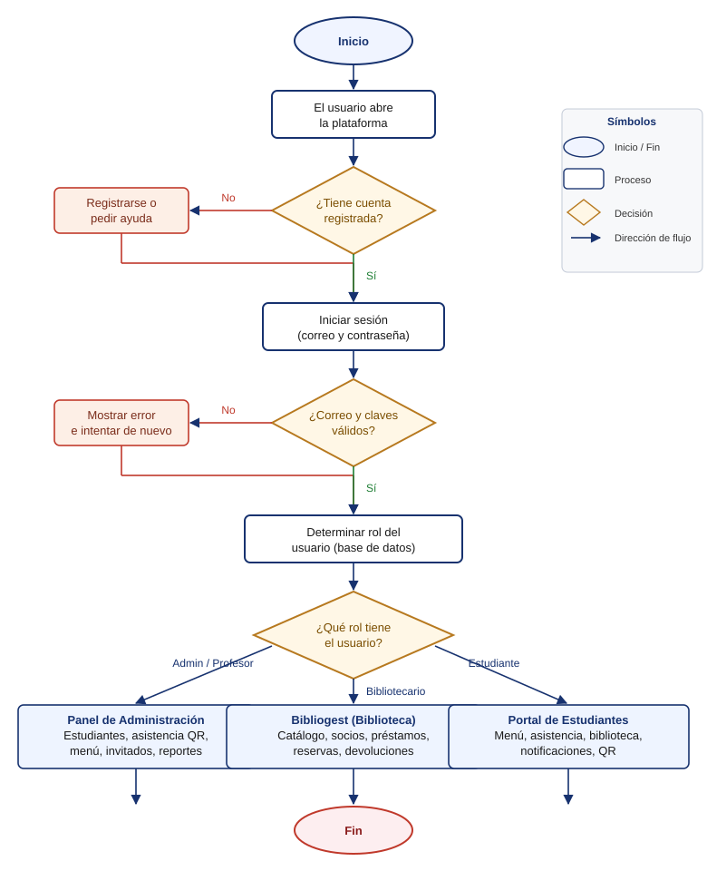

El diagrama indica que el usuario debe **iniciar sesión** (óvalo de inicio) en el sistema con sus credenciales. Si el correo y la contraseña son válidos (rombo de decisión), el sistema identifica el **rol** del usuario y le muestra las opciones que le corresponden:

- **Admin / Profesor** → Panel de administración del comedor (estudiantes, asistencia QR, menú, invitados, reportes).
- **Bibliotecario** → Bibliogest (catálogo, socios, préstamos, reservas, devoluciones).
- **Estudiante** → Portal de estudiantes (menú, asistencia, biblioteca, notificaciones, QR).

El acceso a las opciones está definido por los roles mencionados. Las decisiones con respuesta negativa (cuenta no registrada, credenciales inválidas) regresan al paso anterior para corregir el dato. El proceso termina cuando el usuario **cierra la sesión** (óvalo de fin).

---

# 7. Especificación de casos de uso

A continuación se especifican los casos de uso del Panel de Administración y del Portal de Estudiantes. Cada caso de uso indica actor(es), precondiciones, flujo principal, variaciones/errores y resultado esperado.

## 7.1 Casos de uso del Panel de Administración

### CU-01: Iniciar sesión

- **Actor(es):** admin, profesor, bibliotecario.
- **Precondiciones:** el administrador debe haber creado la cuenta del usuario o haberle asignado un rol.
- **Flujo principal:**
  1. Abra el panel en `https://comeid-670b9.web.app`.
  2. Introduzca su correo y su contraseña.
  3. Pulse **Iniciar sesión**.
  4. El sistema lo lleva al **panel de control**.
- **Resultado esperado:** se muestra el panel con las secciones según el rol. Si el correo o la contraseña son incorrectos, aparece un mensaje de error y se vuelve a pedir el dato.

### CU-02: Consultar el panel de control (Dashboard)

- **Actor(es):** admin, profesor, bibliotecario.
- **Flujo principal:**
  1. Inicie sesión (CU-01).
  2. En las tarjetas vea los indicadores: estudiantes registrados, asistencias del día, invitados del día, ganancias (si aplica), libros prestados o por vencer.
- **Resultado esperado:** vista resumida del estado del comedor y la biblioteca en tiempo real.

### CU-03: Ver y buscar estudiantes

- **Actor(es):** admin, profesor.
- **Flujo principal:**
  1. Pulse **Estudiantes**.
  2. Use la casilla de búsqueda para filtrar por nombre, cédula o sección.
  3. Cada fila muestra nombre, cédula, sección, nivel, tipo (Becado/Pagado) y acciones (editar, QR, eliminar).
- **Resultado esperado:** lista de estudiantes filtrada con acceso a sus acciones.

### CU-04: Registrar un estudiante nuevo con cuenta de acceso

- **Actor(es):** admin, profesor.
- **Precondiciones:** expediente del estudiante (nombre, cédula, sección, nivel, tipo) y, si se le dará cuenta, un correo y contraseña.
- **Flujo principal:**
  1. Pulse **Estudiantes** → **Nuevo estudiante**.
  2. Complete: nombre completo, cédula, sección, nivel y tipo (Becado/Pagado).
  3. Opcionalmente agregue una **foto**.
  4. Si desea crear una cuenta de acceso: marque la opción e introduzca correo y contraseña.
  5. Pulse **Guardar**.
  6. El sistema crea el registro y, en automático: genera el **código QR**, crea la cuenta de acceso (si se pidió), crea el perfil en la colección `usuarios` y deja listo al estudiante para escanear.
- **Errores comunes:** correo ya en uso por otra cuenta (usar otro); cédula duplicada (el sistema avisa).
- **Resultado esperado:** el estudiante queda registrado, con QR, y puede iniciar sesión en el portal.

### CU-05: Editar los datos de un estudiante

- **Actor(es):** admin, profesor.
- **Flujo principal:**
  1. Localice al estudiante (CU-03).
  2. Pulse **Editar**, modifique los campos y **Guardar**.
- **Resultado esperado:** los datos se actualizan en el comedor, la biblioteca y el portal.

### CU-06: Eliminar un estudiante

- **Actor(es):** admin (exclusivo).
- **Precondiciones:** rol admin. Acción **irreversible**.
- **Flujo principal:** localice al estudiante → **Eliminar** → confirme.
- **Resultado esperado:** el estudiante sale de la lista. **Nota técnica:** la cuenta de correo de Firebase puede seguir existiendo; para liberarla, un admin debe eliminarla en la consola de Firebase → Authentication → Users.

### CU-07: Importar estudiantes desde CSV o Excel

- **Actor(es):** admin, profesor.
- **Flujo principal:**
  1. En **Estudiantes**, pulse **Importar**.
  2. Seleccione el archivo (CSV compatible con Excel).
  3. Revise la vista previa (filas válidas e inválidas).
  4. Confirme. Los exitosos se crean con su QR; los inválidos se listan para corregir.
- **Resultado esperado:** registro masivo de estudiantes. **Variación biblioteca:** importación propia de **libros** (clave: código del ejemplar) y **socios** (clave: cédula), con vista previa de filas NUEVO/ACTUALIZAR (CU-13 y CU-12).

### CU-08: Controlar la asistencia al comedor (escaneo QR)

- **Actor(es):** admin, profesor.
- **Precondiciones:** estudiante registrado con QR; equipo con cámara.
- **Flujo principal:**
  1. Pulse **Escanear QR**.
  2. Permita el acceso a la cámara.
  3. Dirija la cámara al QR de la credencial o del móvil.
  4. Al detectar, el sistema identifica al estudiante y **registra la asistencia en automático**, con confirmación sonora y visual.
  5. Si el comedor está habilitado por turno, se valida el turno.
  6. Exporte la **lista del día** en Excel, PDF o CSV si lo desea.
- **Resultado esperado:** cada estudiante escaneado queda marcado como asistente del día, sin colas ni listas en papel.

### CU-09: Generar y entregar credenciales QR

- **Actor(es):** admin, profesor, bibliotecario.
- **Flujo principal:** abra **Generar QR** → seleccione estudiante o grupo → **Generar** → imprima o descargue.
- **Resultado esperado:** credencial imprimible con el QR único para la fila del comedor.

### CU-10: Gestionar invitados externos

- **Actor(es):** admin, profesor.
- **Flujo principal:**
  1. Pulse **Invitados** → **Nuevo invitado**.
  2. Registre nombre y opcionalmente cédula, motivo, frecuencia y observaciones.
  3. **Guardar**. Marque la asistencia del invitado cuando llegue. Los invitados se resetean al día siguiente.
- **Resultado esperado:** control de quién entra al comedor sin ser estudiante.

### CU-11: Configurar el menú semanal

- **Actor(es):** admin, profesor (edición); bibliotecario (solo lectura).
- **Flujo principal:**
  1. Pulse **Menú Semanal**.
  2. Defina **desayunos** y **almuerzos** de lunes a viernes.
  3. **Guardar menú**. Queda publicado en el portal.
  4. (Opcional) Use la **IA** para sugerencias balanceadas.
- **Resultado esperado:** los estudiantes ven cada día qué se sirve.

### CU-12: Gestionar catálogo de libros (biblioteca)

- **Actor(es):** bibliotecario, admin.
- **Flujo principal:**
  1. Cambie a **Biblioteca** con el selector de app.
  2. En **Catálogo**, pulse **Nuevo libro**.
  3. Registre título, autor, categoría, ISBN, ubicación y número de ejemplares. **Guardar**.
  4. Búsqueda, edición y eliminación de títulos.
  5. **Importar Excel/CSV** para carga masiva (clave: código del ejemplar; NUEVO/ACTUALIZAR).
- **Disponibilidad:** el sistema muestra cuántos ejemplares hay **disponibles** y lo recalcula al prestar/devolver; el estudiante lo ve en su portal (*Disponible (n)*). Libros con todos los ejemplares prestados quedan **agotados**.

### CU-13: Gestionar socios de la biblioteca

- **Actor(es):** bibliotecario, admin.
- **Flujo principal:**
  1. Pulse **Socios** → **Nuevo socio** o busque al estudiante.
  2. **Guardar**. Eliminar solo admin.
  3. **Importar Excel/CSV**: cada columna con nombres en español (Nombre, Cédula, Sección, Nivel, Tipo); la **cédula** es la clave (NUEVO/ACTUALIZAR).

### CU-14: Registrar préstamos y devoluciones

- **Actor(es):** bibliotecario, admin.
- **Flujo principal:**
  1. En **Préstamos**, pulse **Nuevo préstamo**.
  2. Seleccione socio y libro (o **escanee el QR** del ejemplar).
  3. El sistema calcula la fecha de vencimiento. **Guardar**.
  4. Para devolver, localice el préstamo activo y pulse **Devolver**.
- **Escáner QR (recomendado):** el sistema responde con **sonido de confirmación**, vibración y mensaje (verde = correcto, rojo = error). Si el socio tiene un solo préstamo activo, el QR devuelve en automático; si tiene varios, se elige cuál devolver.
- **Resultado esperado:** trazabilidad de quién tiene cada libro y cuándo debe devolverlo.

### CU-15: Gestionar reservas de libros

- **Actor(es):** bibliotecario, admin (crear/cancelar); el estudiante reserva desde su portal.
- **Flujo principal:** se reserva un libro prestado o agotado; al devolverse, se atiende por orden; el bibliotecario cancela reservas vencidas.
- **Resultado esperado:** los estudiantes pueden apartar un título aunque esté prestado.

### CU-16: Enviar notificaciones a los estudiantes

- **Actor(es):** gestores (admin, profesor, bibliotecario).
- **Flujo principal:** **Nueva notificación** → título y mensaje → destinatario (todos, uno o grupo) → **Enviar**.
- **Resultado esperado:** los estudiantes ven el aviso en su portal.

### CU-17: Gestionar usuarios y roles

- **Actor(es):** admin (solo).
- **Flujo principal:**
  1. Pulse **Gestión de Usuarios y Roles**.
  2. Seleccione el rol deseado en el desplegable de cada cuenta: **admin**, **profesor**, **estudiante**.
  3. **Guardar cambios**. El cambio es inmediato.
- **Ejemplo:** para entregar una cuenta de admin a un docente, se localiza su cuenta y se selecciona el rol **admin**, luego **Guardar cambios**.

### CU-18: Exportar datos a Excel y PDF

- **Actor(es):** admin, profesor (según sección).
- **Flujo principal:** en las secciones con reportes (Estudiantes, Escáner del día, Historial) use **Exportar** → **Excel** o **PDF**.
- **Resultado esperado:** reportes listos para presentar o archivar.

### CU-19: Configuración general del sistema

- **Actor(es):** admin (solo).
- **Flujo principal:** en **Configuración** ajuste idioma, datos del comedor/biblioteca, turnos y la **clave de la IA de Gemini**; **Guardar**.
- **Resultado esperado:** el sistema se comporta según lo configurado. La configuración es la misma para comedor y biblioteca por compartir base de datos.

### CU-20: Consultar el historial de actividades (auditoría)

- **Actor(es):** gestores.
- **Flujo principal:** abra la sección **Actividad** y consulte el registro de eventos (altas, bajas, cambios de rol, préstamos).
- **Resultado esperado:** trazabilidad de las acciones más importantes del sistema.

## 7.2 Casos de uso del Portal de Estudiantes

### CU-E01: Registrarse y vincular la cuenta

- **Actor(es):** estudiante.
- **Precondiciones:** el estudiante debe existir en el padrón del comedor del CTP (cédula y nombre registrados).
- **Flujo principal:**
  1. Abra `https://comeid-estudiantes.web.app` y pulse **Regístrate aquí**.
  2. Escriba correo institucional (`@ctpliberia.ed.cr`), contraseña, cédula y nombre completo.
  3. **Registrarme**. El sistema valida que la cédula y el nombre coincidan con el registro oficial.
  4. Si el registro no tiene correo asignado, exige el correo institucional.
  5. Al coincidir, la cuenta queda **vinculada** y se abre el portal.
- **Errores comunes:** "Registro no encontrado" (cédula/nombre no coinciden); "Correo ya asignado" (esa cédula fue vinculada con otro correo); "Ya se usa ese correo".
- **Resultado esperado:** el estudiante puede iniciar sesión y usar todas sus secciones.

### CU-E02: Iniciar sesión en el portal

- **Actor(es):** estudiante registrado.
- **Flujo principal:** abra el portal → correo y contraseña → **Iniciar sesión**. Si olvidó la contraseña, use **¿Olvidaste tu contraseña?**.
- **Resultado esperado:** entrada al portal con su información personal.

### CU-E03: Consultar el inicio (Dashboard)

- **Actor(es):** estudiante.
- **Flujo principal:** al entrar vea el **menú de hoy**, sus **reservas activas**, su **asistencia reciente** y los avisos; toque cada tarjeta para abrir la sección.
- **Resultado esperado:** resumen personal al día.

### CU-E04: Ver el menú y su asistencia (Comedor)

- **Actor(es):** estudiante.
- **Flujo principal:**
  1. Abra **Comedor**.
  2. Consulte el **menú de la semana** (lunes a viernes).
  3. Vea su asistencia (consumos en los últimos 30 días y desglose por día de la semana).
  4. Consulte su **historial de consumos**.
- **Resultado esperado:** el estudiante sabe qué se sirve y cuántas veces ha asistido.

### CU-E05: Consultar catálogo, préstamos y reservas (Biblioteca)

- **Actor(es):** estudiante.
- **Flujo principal:**
  1. Abra **Biblioteca**.
  2. Consulte el **catálogo disponible**: use el **buscador** y vea la etiqueta **Disponible (n)** con los ejemplares disponibles ahora mismo.
  3. Vea **Mis préstamos activos**, **Mis reservas** y el **historial de préstamos**.
  4. Puede **reservar** un libro prestado o agotado desde el catálogo.
- **Resultado esperado:** el estudiante encuentra qué hay disponible y controla sus materiales.

### CU-E06: Presentar su credencial QR

- **Actor(es):** estudiante.
- **Flujo principal:** abra **QR** y muestre su código en pantalla (a máximo brillo) para ser escaneado en el comedor.
- **Sugerencia:** guarde una captura para usarla sin conexión.
- **Resultado esperado:** asistencia registrada sin carné físico.

### CU-E07: Consultar notificaciones

- **Actor(es):** estudiante.
- **Flujo principal:** abra **Notificaciones**, vea los avisos y márquelos como leídos.
- **Resultado esperado:** el estudiante está al día con los comunicados.

### CU-E08: Gestionar su perfil

- **Actor(es):** estudiante.
- **Flujo principal:** abra **Perfil**, revise sus datos y el estado de su comer.
- **Resultado esperado:** verificación de que sus datos son correctos. (Cédula y sección solo los cambia la administración.)

### CU-E09: Configurar idioma y tema del portal

- **Actor(es):** estudiante.
- **Flujo principal:** en **Configuración** elija idioma y tema (claro/oscuro) y guarde.
- **Resultado esperado:** el portal se muestra según sus preferencias.

---

# 8. Trazabilidad de requisitos

Para cada requisito funcional (RF) y no funcional (RNF) se definió un **caso de prueba**. La siguiente tabla resume la trazabilidad; los pasos detallados de cada prueba se ejecutan directamente en las dos aplicaciones publicadas.

## 8.1 Casos de prueba funcionales (RF)

| Caso de prueba | Pasos resumidos | Resultado esperado | Cumple |
|---|---|---|---|
| **RF01** Autenticar | Abrir el panel, escribir correo/contraseña válidos, pulsar Iniciar sesión | Entra al panel con las secciones de su rol | Sí |
| **RF02** Usuarios y roles | En Gestión de Usuarios, cambiar el rol de una cuenta y guardar | El nuevo rol aplica de inmediato al recargar | Sí |
| **RF03** Gestionar estudiante | Registrar estudiante con datos y foto | Aparece en el listado con su QR generado | Sí |
| **RF04** Importar estudiantes | Cargar CSV con 3 estudiantes válidos y 1 inválido | Se crean 3; el inválido se lista para corregir | Sí |
| **RF05** Asistencia con QR | Escanear el QR de un estudiante dos veces el mismo día | 1.ª vez: asistencia registrada y confirmación sonora; 2.ª vez: aviso "Ya registrado hoy" | Sí |
| **RF06** Invitados | Registrar un invitado y marcarlo al asistir | Aparece en la lista del día con sus raciones | Sí |
| **RF07** Menú semanal | Guardar desayunos y almuerzos de la semana | El portal muestra lo guardado por día | Sí |
| **RF08** Predicción IA | Consultar Predicción con historial de 28 días | Se muestra proyección de asistencia y raciones | Sí |
| **RF09** Credenciales QR | Generar el QR de un grupo | Se descargan credenciales imprimibles | Sí |
| **RF10** Historial | Consultar historial por estudiante en un rango | Estadísticas y detalle diario del estudiante | Sí |
| **RF11** Catálogo libros | Agregar e importar libros; prestar 1 ejemplar | La disponibilidad disminuye al prestar y aumenta al devolver | Sí |
| **RF12** Socios | Importar socios con cédula repetida | El repetido se marca ACTUALIZAR, los nuevos NUEVO | Sí |
| **RF13** Préstamos/devoluciones | Prestar y devolver con y sin QR | Fecha de vencimiento automática; disponibilidad recalculada | Sí |
| **RF14** Reservas | Reservar un libro agotado y devolverlo | La reserva se atiende por orden al devolverse | Sí |
| **RF15** Alertas | Revisar préstamos vencidos | Se listan los préstamos vencidos y por vencer | Sí |
| **RF16** Notificaciones | Crear y enviar un aviso | Todos/los destinatarios lo ven en su portal | Sí |
| **RF17** Exportar | Exportar asistencia del día a Excel y PDF | Se descargan ambos archivos con datos | Sí |
| **RF18** Registro portal | Registrarse con cédula y nombre válidos | Cuenta vinculada y acceso al portal | Sí |
| **RF19** Menú/asistencia personal | Consultar Comedor en el portal | Se ve el menú semanal y los consumos propios | Sí |
| **RF20** Disponibilidad/biblioteca personal | Consultar catálogo y préstamos en el portal | Se ve *Disponible (n)* y solo los propios préstamos | Sí |
| **RF21** Configuración/auditoría | Cambiar idioma y consultar Actividad | Interface cambia de idioma; eventos listados | Sí |

## 8.2 Casos de prueba no funcionales (RNF)

| Caso de prueba | Pasos resumidos | Resultado esperado | Cumple |
|---|---|---|---|
| **RNF01** Rendimiento | Cronometrar carga del panel y escaneo QR | Carga en pocos segundos; escaneo casi inmediato | Sí |
| **RNF02** Usabilidad | Abrir en computadora, tableta y teléfono | La interfaz se adapta (responsive) | Sí |
| **RNF03** Seguridad | Intentar leer datos de otro estudiante desde la consola | Firestore lo rechaza (reglas por rol) | Sí |
| **RNF04** Portabilidad | Iniciar en Chrome, Edge y Firefox; cambiar idioma | Funciona igual en las tres y en los 5 idiomas | Sí |
| **RNF05** Operacional | Consultar datos sin administrar servidores | Los datos están disponibles desde Firebase | Sí |

---

# 9. Seguridad del sistema

### 9.1 Control de acceso por rol (Firestore Rules)

Todas las operaciones de lectura y escritura están protegidas por reglas del lado del servidor de Firebase. Aunque alguien robara el código o conectara su propio cliente, **no podría** leer ni modificar datos sin cumplir las reglas:

- **Gestores** (admin, profesor, bibliotecario): acceso a la gestión del comedor y la biblioteca.
- **Estudiantes**: solo lectura de **su propia** información, verificada por su `uid` y su cédula.
- **Escrituras restringidas**: un estudiante solo actualiza en su expediente los campos `uid` y `correo`, con correo verificado.
- **Eliminaciones limitadas**: nadie elimina documentos de usuarios ni notificaciones desde el cliente.
- **Colecciones sensibles** (invitados, inventario, notas, historial de comedor): solo gestores.
- **Almacenamiento de archivos** (Firebase Storage): completamente **cerrado** (`deny`).

### 9.2 Cabeceras de seguridad web (CSP)

Ambas aplicaciones envían cabeceras **Content-Security-Policy** que restringen qué recursos puede cargar el navegador:

- Solo scripts de la propia aplicación, de Firebase (`gstatic.com`) y de la librería de íconos (Font Awesome vía `cdnjs`).
- **Sin evaluación de código dinámico** (`eval` prohibido).
- Solo conexiones a los servicios de Firebase/Auth/Firestore y a la API de Gemini.
- Sin incrustación en otras webs (`frame-ancestors 'self'`) y sin objetos embebidos (`object-src 'none'`).

También se envían: `X-Content-Type-Options: nosniff`, `X-Frame-Options: SAMEORIGIN`, `Referrer-Policy` y `Permissions-Policy`.

### 9.3 Sin secretos en el código fuente

- La **clave de la IA (Gemini)** no está escrita en el código: se configura desde el panel y se guarda en el navegador del administrador.
- El repositorio de GitHub posee `.gitignore` que excluye archivos de credenciales.
- Se corrigió un hallazgo crítico: antes un usuario podía crear un perfil con rol "admin"; ahora las reglas fuerzan rol "estudiante" y correo verificado al auto-registrarse.

### 9.4 Correcciones de seguridad aplicadas

1. **Escalada de rol** en la creación de perfiles (corregido en las reglas de Firestore).
2. **Clave de IA expuesta** en el código (retirada; configuración por panel).
3. **Recurso externo bloqueado** por el CSP (generador de QR movido a un CDN permitido).
4. **JSON de configuración inválido** tras añadir cabeceras (reconstruido y validado).

### 9.5 Limitaciones honestas del proyecto

- Es una plataforma **100% frontend** sobre el plan gratuito de Firebase (Spark); la seguridad real reside en las reglas de la base de datos.
- Las **cédulas y nombres** se guardan en texto plano en Firestore (Firestore no cifra campos de forma nativa).
- El CSP permite `'unsafe-inline'` en scripts por pequeños bloques internos de las páginas.
- No hay **2FA** ni límite de intentos de contraseña más allá del control de Firebase.
- Eliminar un estudiante no borra automáticamente su cuenta de autenticación (limitación del plan gratuito).

---

# 10. Conclusiones y trabajo futuro

## 10.1 Conclusiones

El sistema **Integra ID** cumple el objetivo del trabajo: ofrecer al CTP de Liberia una plataforma única para gestionar el comedor estudiantil y la biblioteca. Se logró:

- Un **control de asistencia masivo** mediante escaneo de QR, eliminando colas y listas en papel.
- La **digitalización del catálogo de la biblioteca** con préstamos, devoluciones y reservas en tiempo real.
- Un **portal de auto-servicio** para que cada estudiante consulte su menú, sus consumos y sus libros.
- El apoyo de la **inteligencia artificial** para planificar menús y predecir demanda.
- La implementación de **seguridad por roles** verificada en las reglas de Firestore, con cabeceras CSP y sin secretos en el código.

La metodología de referencia (RUP, dirigida por casos de uso) permitió estructurar la documentación de manera que cada requisito del sistema puede validarse con un caso de prueba, cumpliendo así la trazabilidad de requisitos solicitada.

## 10.2 Trabajo futuro

1. **Funciones de servidor (Cloud Functions):** migrar a plan Blaze para eliminar cuentas de autenticación al dar de baja estudiantes, llamar a la IA desde el servidor y auditar operaciones sensibles.
2. **App Check y 2FA:** activar Firebase App Check y autenticación de dos pasos para cuentas admin.
3. **Endurecer el CSP:** externalizar los scripts inline y retirar `'unsafe-inline'`.
4. **Cifrado de datos personales:** cifrar cédulas y teléfonos antes de guardarlos.
5. **Respaldos programados:** exportación automática de Firestore y manual de restauración.
6. **Reportes ampliados:** desperdicio, costo por platillo, socios más activos, morosidad.
7. **Experiencia:** PWA con soporte offline, recordatorios de devolución por correo y multi-instituto.

---

# 11. Anexos

## A.1 Ficha técnica

| Dato | Valor |
|---|---|
| Nombre comercial | Integra ID |
| Módulo de comedor | ComeID |
| Módulo de biblioteca | Bibliogest |
| Portal de estudiantes | ComeID Estudiantes |
| Autora | Bianka Fernanda Hernández Araya |
| Tecnología | Firebase (Auth, Firestore, Hosting) + Google Gemini (IA) |
| Panel del personal | `https://comeid-670b9.web.app` |
| Portal de estudiantes | `https://comeid-estudiantes.web.app` |
| Idiomas | Español, inglés, portugués, francés, alemán |
| Menú del comedor | Lunes a viernes |
| Repositorio | GitHub — IntegraID-droid/ComeID |

## A.2 URLs del sistema

**Panel de Administración**

| Recurso | URL |
|---|---|
| Login | `https://comeid-670b9.web.app/login.html` |
| Panel principal | `https://comeid-670b9.web.app/index.html` |
| Selector de apps | `https://comeid-670b9.web.app/selector.html` |
| Biblioteca | `https://comeid-670b9.web.app/biblioteca.html` |

**Portal de Estudiantes**

| Recurso | URL |
|---|---|
| Registro | `https://comeid-estudiantes.web.app/registro.html` |
| Login | `https://comeid-estudiantes.web.app/index.html` |
| Dashboard | `https://comeid-estudiantes.web.app/dashboard.html` |
| Comedor | `https://comeid-estudiantes.web.app/comedor.html` |
| Biblioteca | `https://comeid-estudiantes.web.app/biblioteca.html` |
| QR personal | `https://comeid-estudiantes.web.app/qr.html` |
| Notificaciones | `https://comeid-estudiantes.web.app/notificaciones.html` |
| Perfil | `https://comeid-estudiantes.web.app/perfil.html` |
| Configuración | `https://comeid-estudiantes.web.app/configuracion.html` |

## A.3 Preguntas frecuentes

**¿Un profesor puede eliminar estudiantes?** No. Eliminar estudiantes es exclusivo del administrador.

**¿Puede el profesor gestionar la biblioteca?** Sí, si tiene rol de **bibliotecario** o **admin** la gestiona; los profesores con esos roles también. Los demás profesores solo ven el catálogo en solo lectura.

**¿Qué pasa si un estudiante olvida su QR?** Puede marcarse manualmente según la configuración, o volver a generar su QR desde la sección **Generar QR**.

**¿El menú incluye sábados y domingos?** No. El menú se gestiona de lunes a viernes.

**¿Puedo cambiar mi propio rol?** Solo el administrador gestiona roles.

**¿Un estudiante puede ver la información de otro?** No; el portal solo muestra su propia información, y Firestore lo rechaza aunque se intente.

**¿Qué hago si no encuentro mi nombre al registrarme?** Pida al personal que verifique que su cédula y nombre están registrados en el padrón del comedor.

**¿Puedo usar mi QR sin internet?** Sí, guarde una captura de pantalla del QR y preséntela con brillo alto.

**¿Cómo sé si un libro está disponible?** En *Mi biblioteca* abra el **catálogo** y mire la etiqueta **Disponible (n)**: si está agotado, no hay ejemplares libres en ese momento.

## A.4 Glosario

| Término | Significado |
|---|---|
| **Admin** | Administrador del sistema, con todos los permisos. |
| **Bibliotecario** | Rol del personal que gestiona la biblioteca. |
| **Becado / Pagado** | Tipo de estudiante: con beca (sin cobro) o de pago. |
| **Disponible (n)** | Etiqueta del portal que indica los n ejemplares libres de un libro. |
| **Firestore** | Base de datos NoSQL de Firebase, con reglas de seguridad. |
| **Gestor** | Admin, profesor o bibliotecario registrado en el panel. |
| **IA / Gemini** | Inteligencia artificial de Google usada para menús y predicciones. |
| **Padrón** | Registro oficial de estudiantes del comedor del CTP. |
| **QR** | Código de respuesta rápida usado como credencial del estudiante. |
| **RUP** | Proceso Racional Unificado, metodología de referencia del proyecto. |
| **Socio** | Estudiante con derecho a usar la biblioteca. |
| **CSP** | Content-Security-Policy, cabecera de seguridad web. |
| **CDN** | Red de distribución de contenido que sirve las librerías (Font Awesome, Firebase). |
| **PWA** | Aplicación web progresiva; permite caché local y uso parcial sin conexión. |

## A.5 Capturas de pantalla

> Las capturas siguientes fueron tomadas de la **versión publicada** (sitio real) en modo oscuro, con sesión activa.

### A.5.1 Inicio de sesión del Panel de Administración

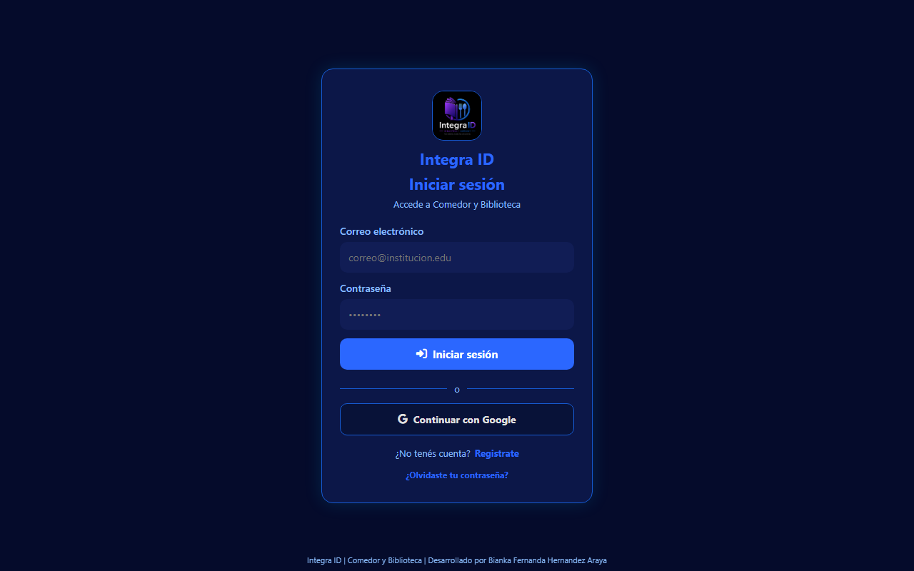

*Figura A.1 — Pantalla de inicio de sesión del panel de administración (comeid-670b9.web.app).*

### A.5.2 Panel principal (Dashboard)

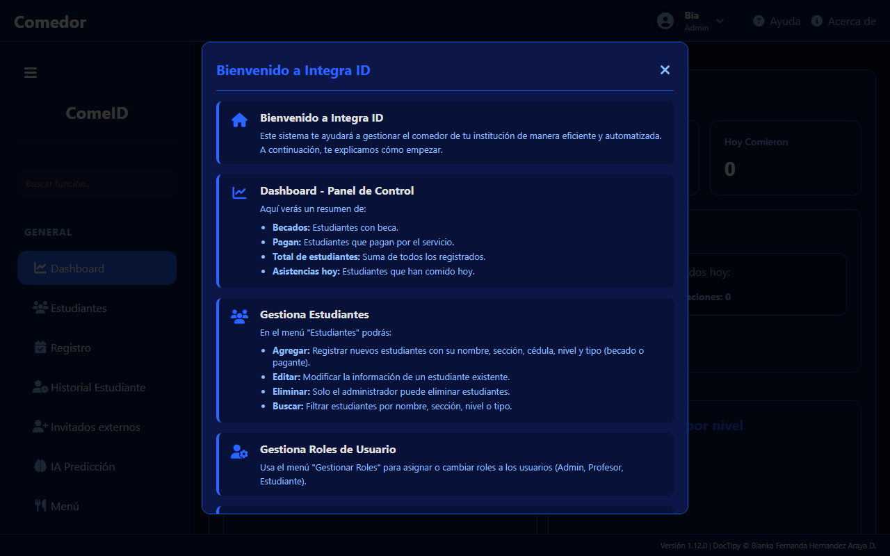

*Figura A.2 — Panel principal del administrador con el resumen general del sistema.*

### A.5.3 Selector de aplicaciones del panel

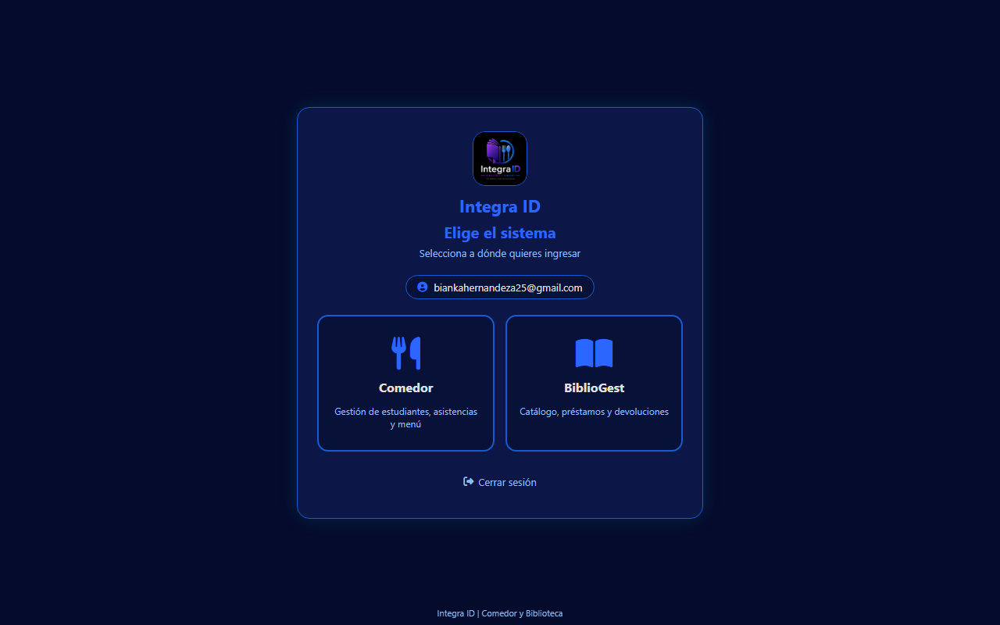

*Figura A.3 — Selector de módulos (comedor y biblioteca) del panel de administración.*

### A.5.4 Gestión de la biblioteca en el panel

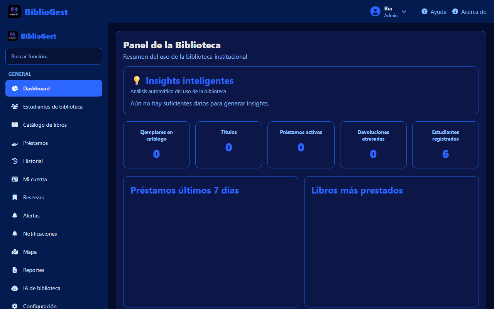

*Figura A.4 — Catálogo y gestión de la biblioteca desde el panel (Bibliogest).*

### A.5.5 Inicio de sesión del Portal de Estudiantes

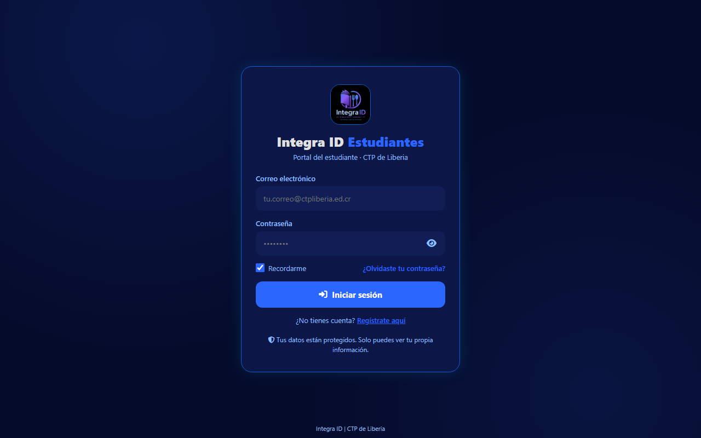

*Figura A.5 — Pantalla de inicio de sesión del portal de estudiantes (comeid-estudiantes.web.app).*

### A.5.6 Registro de estudiantes en el Portal

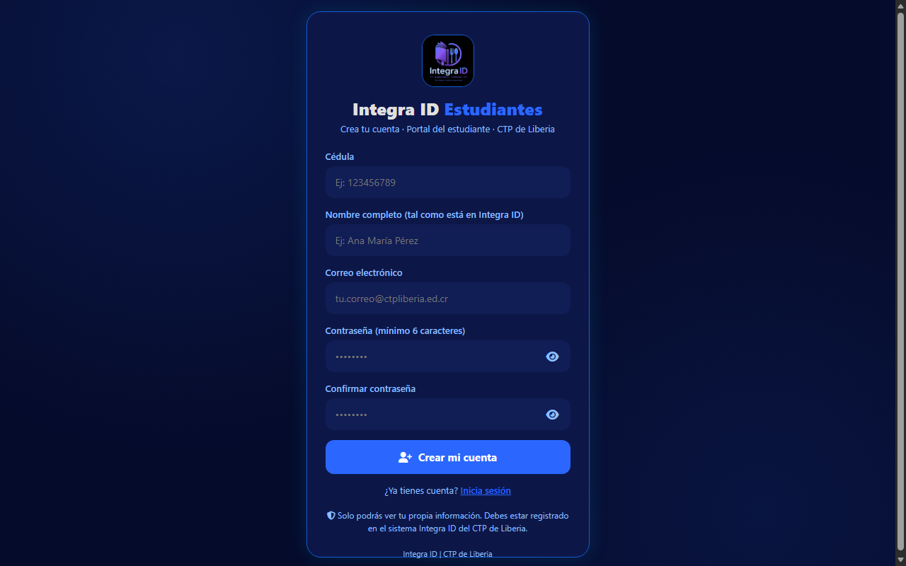

*Figura A.6 — Pantalla de registro de estudiantes con confirmación de datos.*

### A.5.7 Dashboard del estudiante

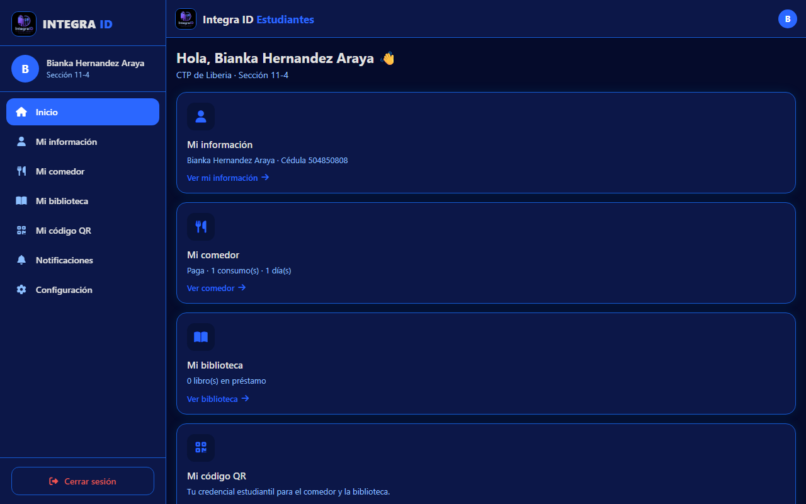

*Figura A.7 — Resumen personal del estudiante: asistencia al comedor, libros prestados y próximas fechas.*

### A.5.8 Comedor del estudiante

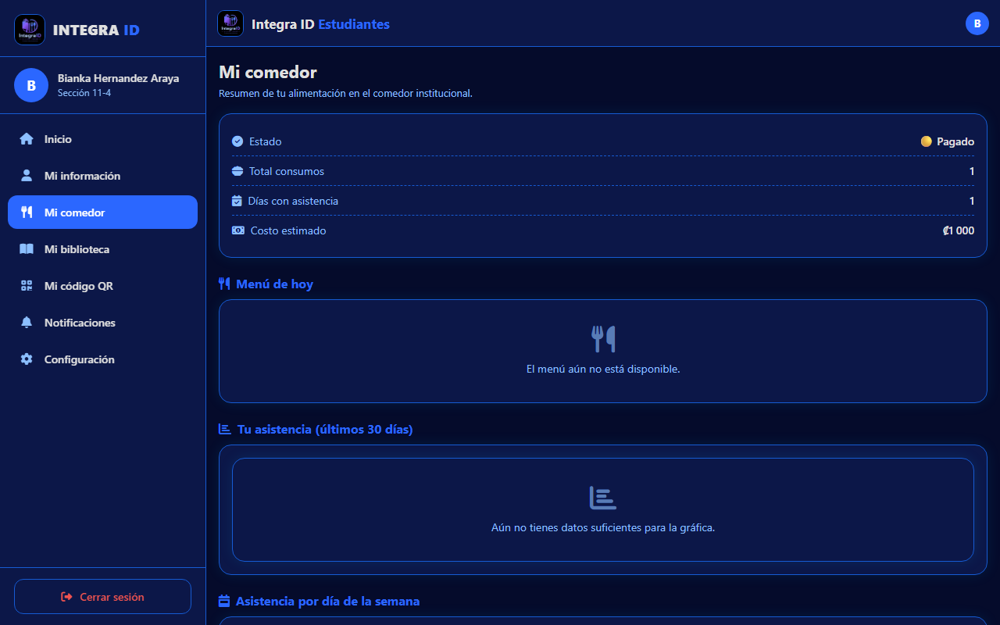

*Figura A.8 — Menú semanal del comedor y consumo del estudiante.*

### A.5.9 Biblioteca del estudiante

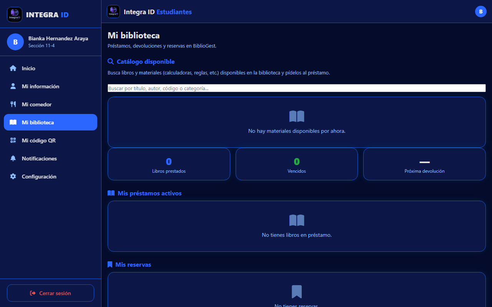

*Figura A.9 — Catálogo de la biblioteca y préstamos del estudiante desde el portal.*

### A.5.10 Credencial QR del estudiante

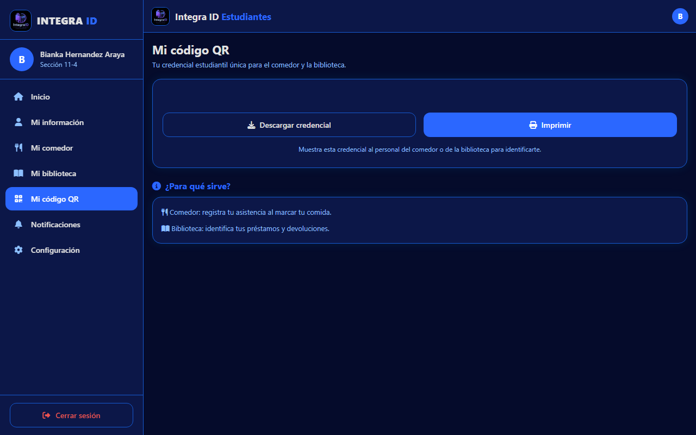

*Figura A.10 — Credencial QR personal del estudiante para asistencia al comedor.*

### A.5.11 Perfil del estudiante

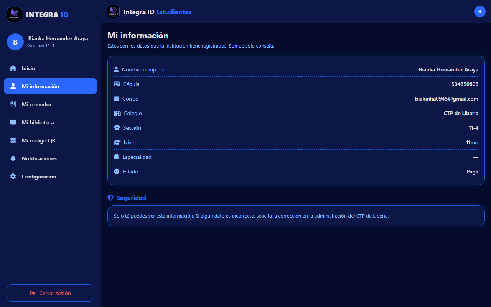

*Figura A.11 — Datos personales y configuración de la cuenta del estudiante.*

### A.5.12 Notificaciones del estudiante

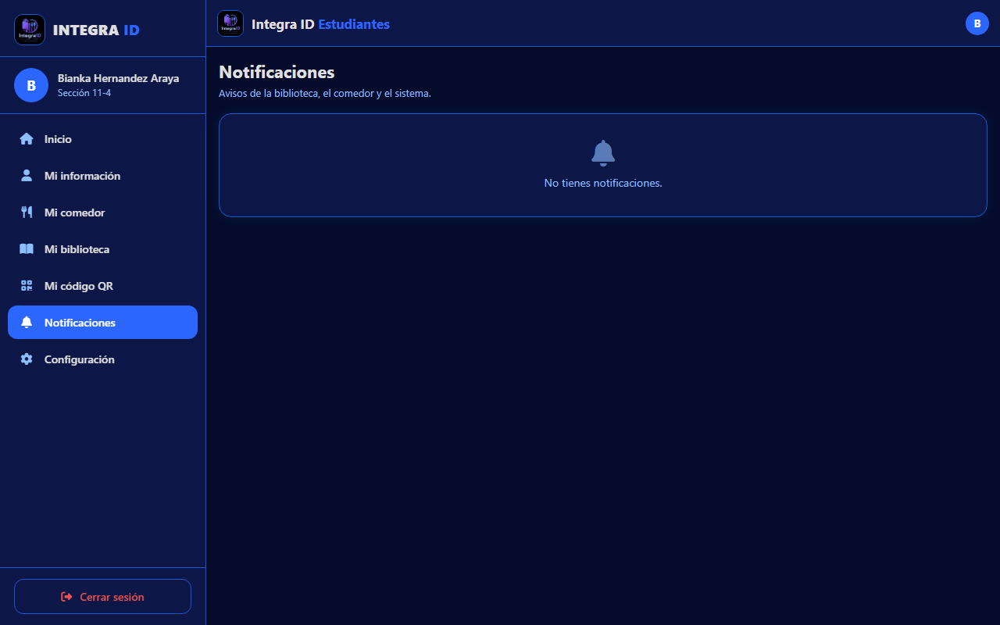

*Figura A.12 — Centro de notificaciones y avisos del estudiante.*

# 12. Derechos de autor

## 12.1 Aviso de derechos de autor

**© 2026 Bianka Fernanda Hernández Araya. Todos los derechos reservados.**

Esta obra (software, código fuente, diseño, diagramas y documentación) fue **creada y desarrollada por Bianka Fernanda Hernández Araya** como **proyecto estudiantil** del **Colegio Técnico Profesional (CTP) de Liberia**, Costa Rica.

## 12.2 Condiciones de uso

- El uso del sistema es **exclusivo de la institución** (CTP de Liberia) y de las personas autorizadas por la administración.
- Queda prohibida la **reproducción, distribución, modificación o venta** de este material, total o parcial, sin la autorización escrita de los autores y de la institución.
- Las **reglas de seguridad de Firestore** protegen los datos: ningún usuario puede leer o escribir información sin el permiso de su rol.

## 12.3 Reconocimientos

- **Google Firebase** (Auth, Firestore, Hosting, Functions) — plataforma de respaldo del sistema.
- **Google Gemini** — modelos de inteligencia artificial utilizados para la asistencia de menús y predicciones.
- **Font Awesome** — íconos de la interfaz.
- Al profesorado y la comunidad del **CTP de Liberia** que colaboró con la definición de los procesos (comedor, biblioteca y asistencia).

## 12.4 Contacto institucional

| Área | Medio |
|---|---|
| Institución | Colegio Técnico Profesional de Liberia, Guanacaste, Costa Rica |
| Autora | Bianka Fernanda Hernández Araya |
| Proyecto | Integra ID (ComeID, Bibliogest, Portal de Estudiantes) |
| Repositorio | GitHub — `IntegraID-droid/ComeID` |

---

*Documento elaborado como manual de uso, documentación técnica y presentación del proyecto Integra ID (ComeID, Bibliogest y Portal de Estudiantes), desarrollado por Bianka Fernanda Hernández Araya — CTP de Liberia, Costa Rica.*

*© 2026 Bianka Fernanda Hernández Araya — Colegio Técnico Profesional de Liberia. Todos los derechos reservados.*